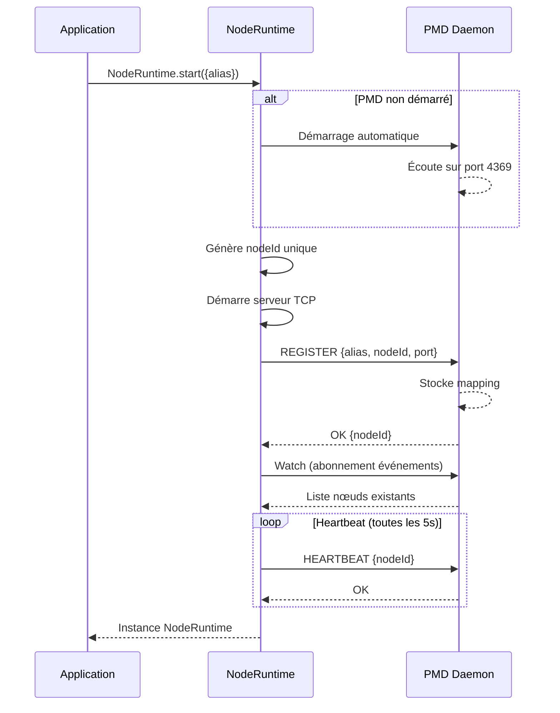
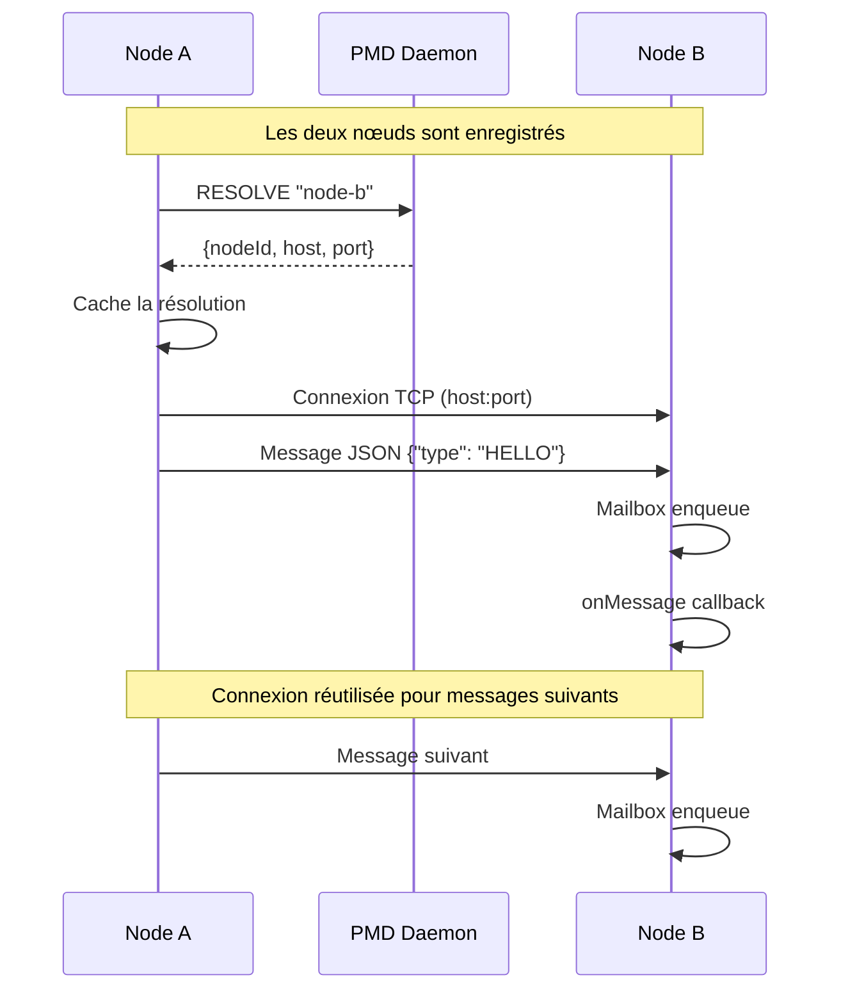
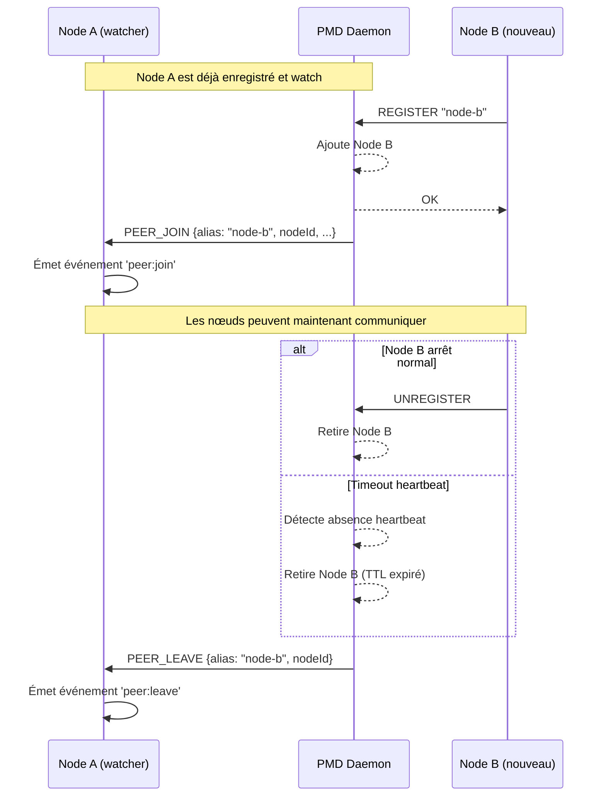
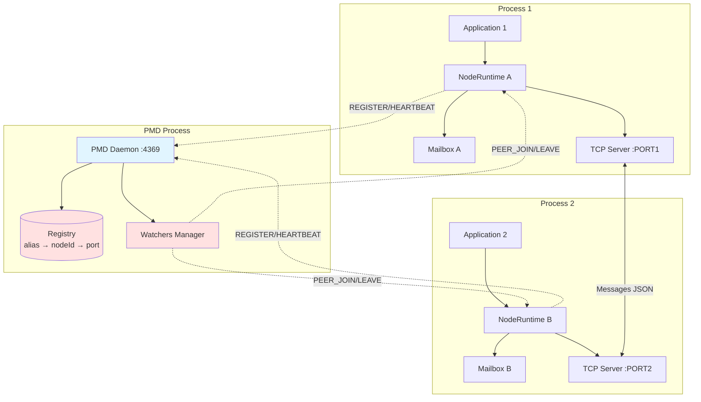

# distflow

Framework TypeScript pour le développement distribué inspiré du modèle Erlang.

## Description

**distflow** est un framework léger pour la communication distribuée en TypeScript, proposant :

- **PMD (Port Mapper Daemon)** : registre de nœuds inspiré d'epmd d'Erlang
- **Communication fire-and-forget** : messaging asynchrone via TCP
- **Découverte automatique** : enregistrement et découverte de pairs
- **Mailbox par nœud** : système de boîte aux lettres avec stratégie configurable
- **Un nœud par processus** : architecture singleton garantie
- **Logger structuré** : logging avec niveaux, contextes et transports personnalisables
- **JSON-CRDT** : synchronisation d'état distribuée avec résolution de conflits
- **RingNode** : topologie en anneau pour coordination distribuée

## Caractéristiques

✅ Démarrage automatique du PMD  
✅ Enregistrement transparent des nœuds  
✅ Communication TCP avec JSON framing  
✅ Mailbox configurable (taille max + stratégie drop-newest)  
✅ Événements peer:join et peer:leave  
✅ Alias logiques pour les nœuds  
✅ CLI d'administration  
✅ Logger structuré avec niveaux et contextes  
✅ JSON-CRDT pour état distribué  
✅ RingNode pour topologies en anneau  

## Structure du projet

```bash
distflow/
├── packages/
│   ├── core/     # Librairie principale (@distflow/core)
│   ├── pmd/      # Port Mapper Daemon (@distflow/pmd)
│   └── cli/      # CLI d'administration (@distflow/cli)
├── examples/     # Exemples d'utilisation
└── agents/       # Règles et guides de développement
```

## Installation

```bash
# Clone le repository
git clone https://github.com/pierreg256/distflow.git
cd distflow

# Installer les dépendances
npm install

# Build tous les packages
npm run build
```

## Utilisation

### Exemple basique

```typescript
import { NodeRuntime } from "@distflow/core";

// Démarrer un nœud (PMD lancé automatiquement)
const node = await NodeRuntime.start({
  alias: "my-service",
  mailbox: {
    maxSize: 1000,
    overflow: "drop-newest"
  }
});

// Écouter les messages
node.onMessage((message, meta) => {
  console.log(`Message from ${meta.from}:`, message);
});

// Envoyer un message
await node.send("other-service", { type: "HELLO" });

// Découvrir les pairs
const peers = await node.discover();

// Écouter les événements de découverte
node.on("peer:join", (peer) => {
  console.log("New peer:", peer.alias);
});

node.on("peer:leave", (peer) => {
  console.log("Peer left:", peer.alias);
});
```

### CLI

```bash
# Vérifier le statut du PMD
distflow pmd status

# Lister les nœuds enregistrés
distflow pmd list

# Résoudre un alias
distflow pmd resolve my-service

# Arrêter le PMD
distflow pmd kill
```

### Logger structuré

```typescript
import { getLogger, LogLevel, configureLogger } from "@distflow/core";

// Configuration globale (optionnelle)
configureLogger({
  level: LogLevel.DEBUG,
  prettyPrint: true,
  name: "my-app"
});

// Obtenir un logger
const logger = getLogger("my-service");

// Logging basique
logger.info("Service started", { port: 3000 });
logger.warn("High memory usage", { usage: "85%" });
logger.error("Connection failed", new Error("ECONNREFUSED"));

// Logger enfant avec contexte
const requestLogger = logger.child({
  requestId: "req-123",
  userId: "user-456"
});

requestLogger.info("Request received");
requestLogger.info("Processing completed", { duration: 123 });
```

📖 Voir [packages/core/docs/LOGGER.md](packages/core/docs/LOGGER.md) pour la documentation complète.

## Exemples

Consultez le dossier `examples/` pour des exemples complets :

- **ping-pong** : communication simple entre deux nœuds
- **multi-node** : exemple avec plusieurs nœuds

## Architecture

### PMD (Port Mapper Daemon)

Le PMD est un daemon local qui :

- Enregistre les nœuds avec leurs ports
- Maintient un mapping alias → nodeId → host:port
- Gère le TTL et les heartbeats
- Notifie les watchers des événements peer:join/leave

### Node Runtime

Chaque processus peut démarrer **un seul nœud** qui :

- Lance automatiquement le PMD si absent
- S'enregistre automatiquement
- Maintient une connexion heartbeat
- Expose une mailbox pour recevoir des messages
- Communique via TCP avec les autres nœuds

### Communication

- **Transport** : TCP avec framing (4 bytes length + JSON)
- **Format** : JSON uniquement
- **Modèle** : fire-and-forget (pas d'appel synchrone)
- **Mailbox** : FIFO avec taille configurable et stratégie drop-newest

## Flux de Communication

### Démarrage d'un nœud

Le diagramme suivant illustre le processus de démarrage d'un nœud et son enregistrement auprès du PMD :



### Communication entre nœuds

Le diagramme suivant montre comment deux nœuds communiquent via le PMD :



### Découverte de pairs et événements

Le diagramme suivant illustre le mécanisme de découverte et les événements `peer:join` / `peer:leave` :



### Architecture globale



## Développement

### Build

```bash
npm run build
```

### Clean

```bash
npm run clean
```

### Tests

```bash
npm test
```

## Règles de développement

Consultez les fichiers dans `agents/` pour les règles spécifiques :

- `agents/general/agents.md` : règles générales du projet
- `agents/lib/agents.md` : règles pour le développement de la lib
- `agents/examples/agents.md` : règles pour les exemples

## Packages

### @distflow/core

Librairie principale à intégrer dans vos applications.

### @distflow/pmd

Port Mapper Daemon - processus de registre local.

### @distflow/cli

Outils en ligne de commande pour administrer le PMD.

## TODO - JSON-CRDT Improvements

### 🔴 Critique (memory leaks & correctness) ✅ COMPLETED

- [x] **Garbage collection du log**
  - [x] Implémenter `gcLog(keepLastN)`: limiter croissance du log
  - [x] Ajouter compaction périodique automatique
  - [x] Permettre configuration de la taille max du log
  - [x] Émettre événement quand GC effectué

- [x] **Tombstones pour DELETE**
  - [x] Ajouter type `OpKind = "set" | "del" | "tombstone"`
  - [x] Conserver tombstones au lieu de vraiment supprimer
  - [x] Empêcher anciennes SET de ressusciter données supprimées
  - [x] GC des tombstones après période de grâce configurable

- [x] **Cleanup de la lww Map**
  - [x] Limiter taille de la Map (ex: 100k paths max)
  - [x] Nettoyer paths tombstone après période
  - [x] Ajouter LRU cache pour paths fréquents
  - [x] Émettre warning quand proche de la limite

- [x] **Cleanup du pending buffer**
  - [x] Limiter taille du buffer pending (ex: 10k ops max)
  - [x] Ajouter timeout pour ops en attente trop longtemps
  - [x] Détecter et rejeter ops impossibles à appliquer
  - [x] Logger/métrique pour ops abandonnées

### 🟡 Important (production-ready) ✅ COMPLETED

- [x] **Persistence et snapshots**
  - [x] Implémenter `snapshot(): CrdtSnapshot` (doc + vc + hlc + lww)
  - [x] Implémenter `restore(snap: CrdtSnapshot): void`
  - [x] Sérialisation/désérialisation efficace
  - [x] Support chargement depuis fichier/DB

- [x] **Gestion conflits path hiérarchiques**
  - [x] Détecter conflit parent/enfant (delete parent, set enfant)
  - [x] Stratégie résolution : delete gagne vs set gagne vs merge
  - [x] Valider paths avant application
  - [x] Logs d'avertissement pour conflits détectés

- [x] **Event system pour réactivité**
  - [x] Étendre EventEmitter pour émettre changements
  - [x] Implémenter `watch(path, callback)` pour observer paths
  - [x] Événements: 'change', 'conflict', 'gc', 'sync'
  - [x] Permettre filtrage événements par path patterns

- [ ] **Compaction du Vector Clock**
  - [ ] Utiliser dot notation `[ReplicaId, number]` au lieu de VC complet
  - [ ] Compacter VCs dans les Ops stockées
  - [ ] Réduire overhead mémoire et réseau
  - [ ] Maintenir backward compatibility

### 🟢 Nice-to-have (améliorations)

- [ ] **RGA pour arrays (CRDT arrays)**
  - [ ] Implémenter Replicated Growable Array
  - [ ] Support insertions/suppressions concurrentes correctes
  - [ ] API: `insertAt(index, value)`, `removeAt(index)`
  - [ ] Détecter automatiquement quand utiliser RGA vs objet

- [ ] **Anti-entropy et réconciliation active**
  - [ ] Implémenter merkle tree pour hash d'état
  - [ ] Détection rapide de divergences
  - [ ] Protocole gossip pour synchronisation active
  - [ ] Auto-heal après partitions réseau

- [ ] **Support Move operations**
  - [ ] Nouveau type d'op: `move` avec fromPath/toPath
  - [ ] Résolution conflits move concurrents
  - [ ] Optimisation pour renommages/réorganisations
  - [ ] Préserver historique après move

- [ ] **Stratégies de résolution de conflits**
  - [ ] LWW (actuel), LWW-bias (préférence replica)
  - [ ] Multi-value (garder toutes valeurs concurrentes)
  - [ ] Custom merge functions par path
  - [ ] Configuration globale ou par path

- [ ] **Schema validation**
  - [ ] Définir et valider schémas JSON
  - [ ] Rejeter ops qui violent le schéma
  - [ ] Support évolution schéma (migrations)
  - [ ] Validation côté set() et receive()

- [ ] **Optimistic UI support**
  - [ ] `setOptimistic(path, value)` pour UI instantanée
  - [ ] Système de confirmation d'ops
  - [ ] Rollback automatique si op rejetée
  - [ ] Marquage visuel ops non-confirmées

### 📊 Observabilité et debug

- [ ] **Métriques et monitoring**
  - [ ] Taille log, lww map, pending buffer
  - [ ] Nombre ops/sec, latence application
  - [ ] Taux de conflits, GC stats
  - [ ] Export vers Prometheus/StatsD

- [ ] **Logging structuré**
  - [ ] Niveaux: debug, info, warn, error
  - [ ] Contexte: replicaId, opId, path
  - [ ] Traçabilité causale via VC
  - [ ] Integration avec Winston/Pino

- [ ] **Outils de debug**
  - [ ] `inspect()`: dump état interne complet
  - [ ] Visualisation graph causal dépendances
  - [ ] Replay log pour debugging
  - [ ] Diff entre états/snapshots

## TODO - RingNode DHT Implementation

### 🎯 Court terme (essentiel)

- [ ] **Stockage et partitionnement de données**
  - [ ] Ajouter `findResponsibleNode(key: string): RingMember`
  - [ ] Implémenter `put(key: string, value: any): Promise<void>`
  - [ ] Implémenter `get(key: string): Promise<any>`
  - [ ] Ajouter stockage local clé-valeur avec plages de responsabilité

- [ ] **Successor list (résilience)**
  - [ ] Remplacer successor unique par `successorList: RingMember[]` (3-5 nœuds)
  - [ ] Implémenter basculement automatique si successor principal tombe
  - [ ] Maintenir la liste à jour lors des changements de topologie

- [ ] **Protocole de stabilisation**
  - [ ] Implémenter `stabilize()`: vérifier et corriger le successor
  - [ ] Implémenter `notify(node)`: notifier qu'on pense être predecessor
  - [ ] Ajouter tâche périodique de stabilisation (ex: toutes les 10s)

### 🛠️ Moyen terme (robustesse)

- [ ] **Finger table (routing optimisé O(log N))**
  - [ ] Implémenter `fingerTable: RingMember[]`
  - [ ] Créer `buildFingerTable()`: calculer finger[i] = successor de (n + 2^(i-1))
  - [ ] Implémenter `fixFingers()`: mise à jour périodique aléatoire des entrées
  - [ ] Utiliser finger table dans le routing pour améliorer performance

- [ ] **Réplication N-way**
  - [ ] Implémenter `replicateToSuccessors(key, value, n=3)`
  - [ ] Assurer cohérence éventuelle entre réplicas
  - [ ] Gérer lecture avec préférence de réplica
  - [ ] Implémenter stratégie de réconciliation en cas de divergence

- [ ] **Transfert de données lors join/leave**
  - [ ] Implémenter `onNodeJoin(newNode)`: transférer clés appropriées
  - [ ] Implémenter `onNodeLeave(oldNode)`: récupérer clés orphelines
  - [ ] Calculer plages de clés avec `getKeysInRange(start, end)`
  - [ ] Gérer migration progressive pour éviter surcharge

### 🚀 Long terme (optimisation)

- [ ] **Lookup distribué avec routing**
  - [ ] Implémenter `lookup(key): Promise<RingMember>`
  - [ ] Utiliser `closestPrecedingNode(keyHash)` pour router efficacement
  - [ ] Ajouter cache de lookups récents
  - [ ] Implémenter timeout et retry pour lookups

- [ ] **Virtual nodes (vnodes)**
  - [ ] Définir interface `VirtualNode { vnodeId, hash, realNodeId }`
  - [ ] Créer multiple vnodes par nœud physique (ex: 10-50)
  - [ ] Améliorer distribution de charge et gestion failures
  - [ ] Faciliter migration lors ajout/retrait de nœuds

- [ ] **Détection de pannes proactive**
  - [ ] Implémenter `checkPredecessor()`: ping périodique
  - [ ] Ajouter détection de latence/performance
  - [ ] Créer circuit breaker pour nœuds défaillants
  - [ ] Implémenter gossip protocol pour diffusion rapide d'info

- [ ] **Range queries**
  - [ ] Implémenter `getRange(startKey, endKey): Promise<Map<string, any>>`
  - [ ] Permettre itération sur plages de clés
  - [ ] Optimiser pour scans distribués
  - [ ] Ajouter pagination pour grandes plages

### 📋 Améliorations additionnelles

- [ ] **Monitoring et observabilité**
  - [ ] Métriques : nombre de clés, taille données, latence ops
  - [ ] Health checks exposés via API
  - [ ] Logs structurés avec niveaux configurables
  - [ ] Traçage distribué pour debugging

- [ ] **Sécurité**
  - [ ] Authentification entre nœuds
  - [ ] Chiffrement des données en transit
  - [ ] Gestion de permissions pour clés
  - [ ] Rate limiting et protection DoS

- [ ] **Tests et validation**
  - [ ] Tests unitaires pour toutes les opérations CRUD
  - [ ] Tests d'intégration multi-nœuds
  - [ ] Tests de chaos (pannes aléatoires)
  - [ ] Benchmarks de performance

## License

MIT
