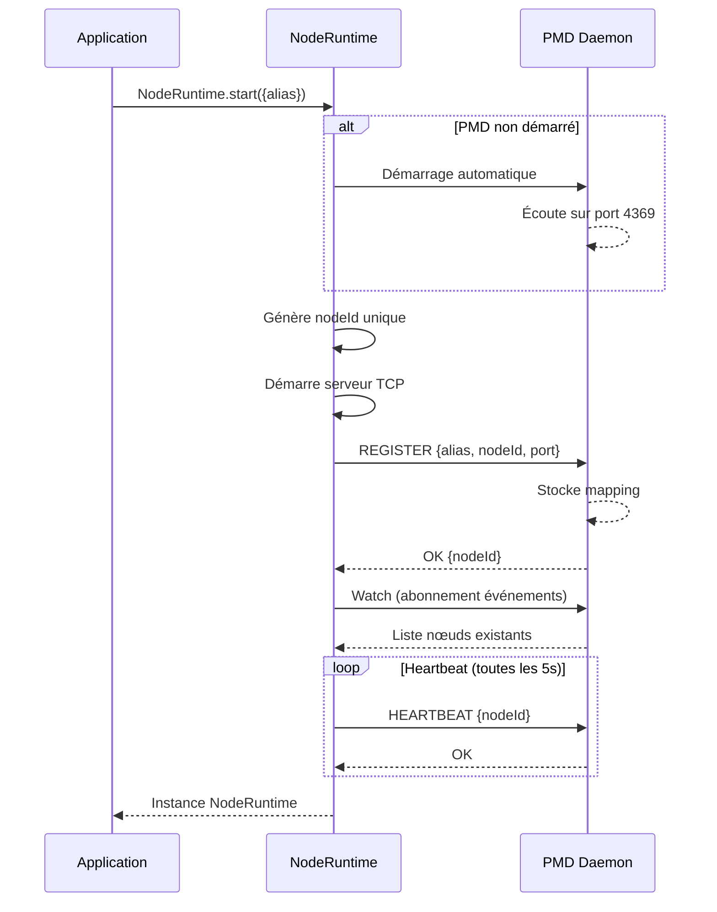
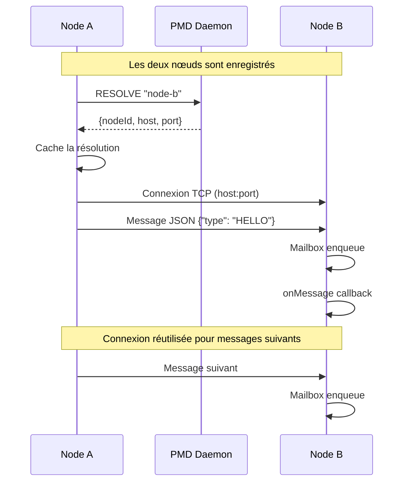
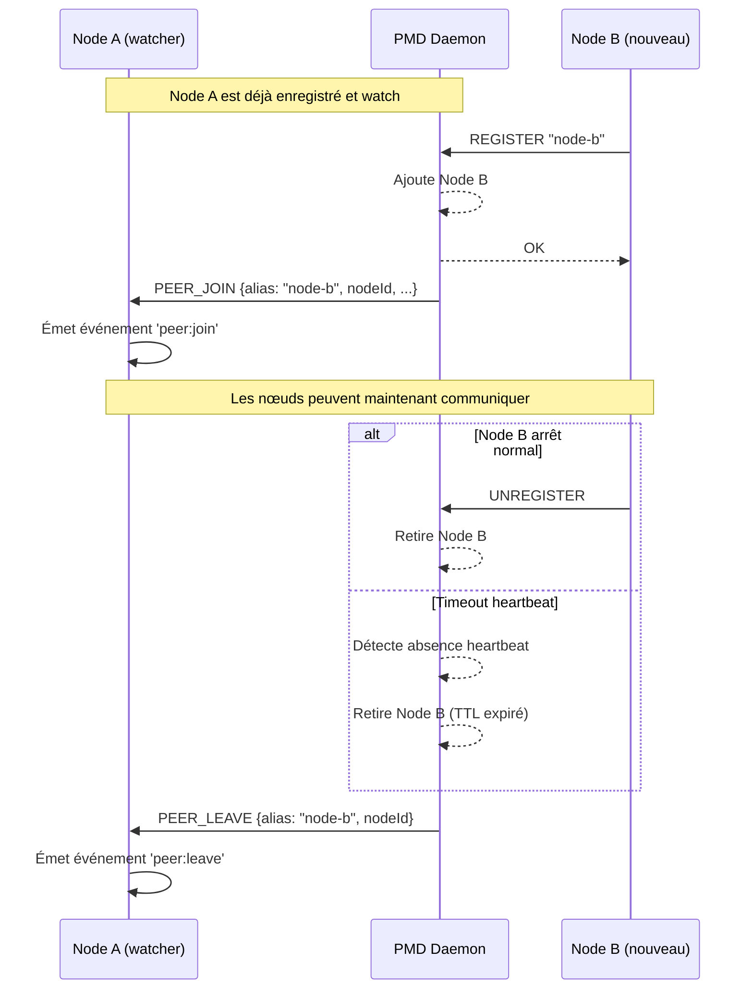
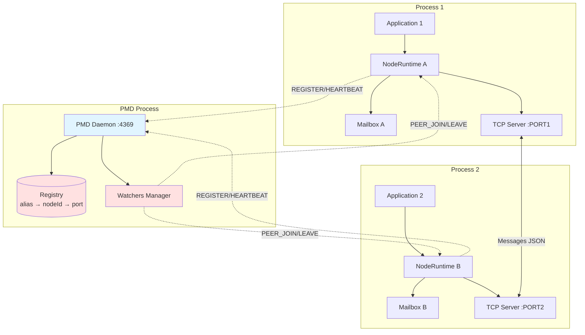

# distflow

Framework TypeScript pour le développement distribué inspiré du modèle Erlang.

## Description

**distflow** est un framework léger pour la communication distribuée en TypeScript, proposant :

- **PMD (Port Mapper Daemon)** : registre de nœuds inspiré d'epmd d'Erlang
- **Communication fire-and-forget** : messaging asynchrone via TCP
- **Découverte automatique** : enregistrement et découverte de pairs
- **Mailbox par nœud** : système de boîte aux lettres avec stratégie configurable
- **Un nœud par processus** : architecture singleton garantie

## Caractéristiques

✅ Démarrage automatique du PMD  
✅ Enregistrement transparent des nœuds  
✅ Communication TCP avec JSON framing  
✅ Mailbox configurable (taille max + stratégie drop-newest)  
✅ Événements peer:join et peer:leave  
✅ Alias logiques pour les nœuds  
✅ CLI d'administration  

## Structure du projet

```bash
distflow/
├── packages/
│   ├── core/     # Librairie principale (@distflow/core)
│   ├── pmd/      # Port Mapper Daemon (@distflow/pmd)
│   └── cli/      # CLI d'administration (@distflow/cli)
├── examples/     # Exemples d'utilisation
└── agents/       # Règles et guides de développement
```

## Installation

```bash
# Clone le repository
git clone https://github.com/pierreg256/distflow.git
cd distflow

# Installer les dépendances
npm install

# Build tous les packages
npm run build
```

## Utilisation

### Exemple basique

```typescript
import { NodeRuntime } from "@distflow/core";

// Démarrer un nœud (PMD lancé automatiquement)
const node = await NodeRuntime.start({
  alias: "my-service",
  mailbox: {
    maxSize: 1000,
    overflow: "drop-newest"
  }
});

// Écouter les messages
node.onMessage((message, meta) => {
  console.log(`Message from ${meta.from}:`, message);
});

// Envoyer un message
await node.send("other-service", { type: "HELLO" });

// Découvrir les pairs
const peers = await node.discover();

// Écouter les événements de découverte
node.on("peer:join", (peer) => {
  console.log("New peer:", peer.alias);
});

node.on("peer:leave", (peer) => {
  console.log("Peer left:", peer.alias);
});
```

### CLI

```bash
# Vérifier le statut du PMD
distflow pmd status

# Lister les nœuds enregistrés
distflow pmd list

# Résoudre un alias
distflow pmd resolve my-service

# Arrêter le PMD
distflow pmd kill
```

## Exemples

Consultez le dossier `examples/` pour des exemples complets :

- **ping-pong** : communication simple entre deux nœuds
- **multi-node** : exemple avec plusieurs nœuds

## Architecture

### PMD (Port Mapper Daemon)

Le PMD est un daemon local qui :

- Enregistre les nœuds avec leurs ports
- Maintient un mapping alias → nodeId → host:port
- Gère le TTL et les heartbeats
- Notifie les watchers des événements peer:join/leave

### Node Runtime

Chaque processus peut démarrer **un seul nœud** qui :

- Lance automatiquement le PMD si absent
- S'enregistre automatiquement
- Maintient une connexion heartbeat
- Expose une mailbox pour recevoir des messages
- Communique via TCP avec les autres nœuds

### Communication

- **Transport** : TCP avec framing (4 bytes length + JSON)
- **Format** : JSON uniquement
- **Modèle** : fire-and-forget (pas d'appel synchrone)
- **Mailbox** : FIFO avec taille configurable et stratégie drop-newest

## Flux de Communication

### Démarrage d'un nœud

Le diagramme suivant illustre le processus de démarrage d'un nœud et son enregistrement auprès du PMD :



### Communication entre nœuds

Le diagramme suivant montre comment deux nœuds communiquent via le PMD :



### Découverte de pairs et événements

Le diagramme suivant illustre le mécanisme de découverte et les événements `peer:join` / `peer:leave` :



### Architecture globale



## Développement

### Build

```bash
npm run build
```

### Clean

```bash
npm run clean
```

### Tests

```bash
npm test
```

## Règles de développement

Consultez les fichiers dans `agents/` pour les règles spécifiques :

- `agents/general/agents.md` : règles générales du projet
- `agents/lib/agents.md` : règles pour le développement de la lib
- `agents/examples/agents.md` : règles pour les exemples

## Packages

### @distflow/core

Librairie principale à intégrer dans vos applications.

### @distflow/pmd

Port Mapper Daemon - processus de registre local.

### @distflow/cli

Outils en ligne de commande pour administrer le PMD.

## License

MIT
