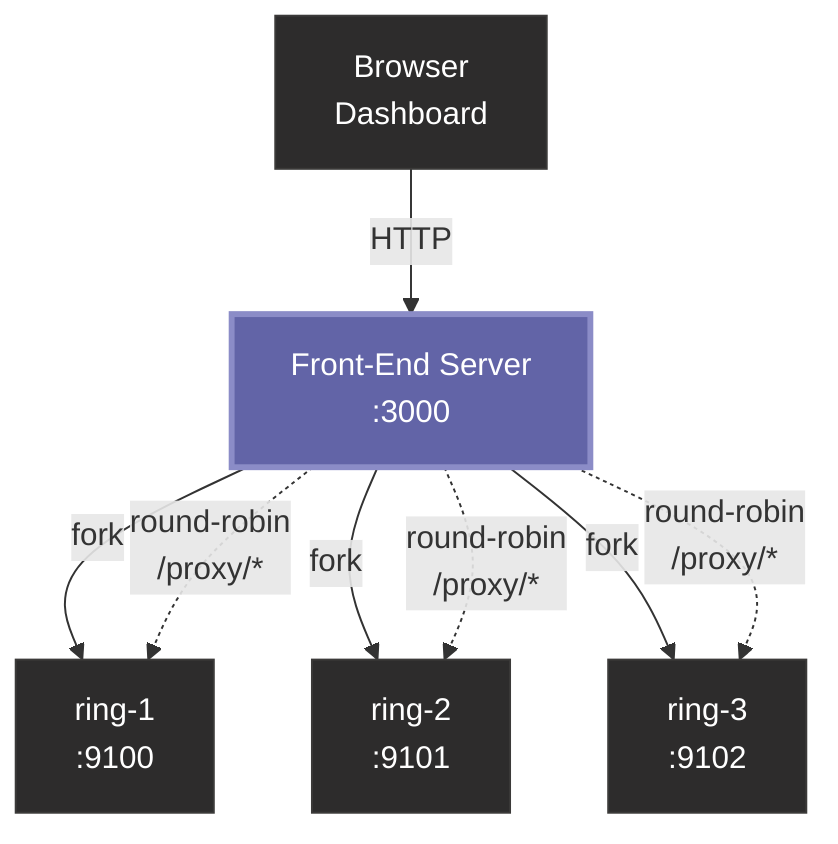
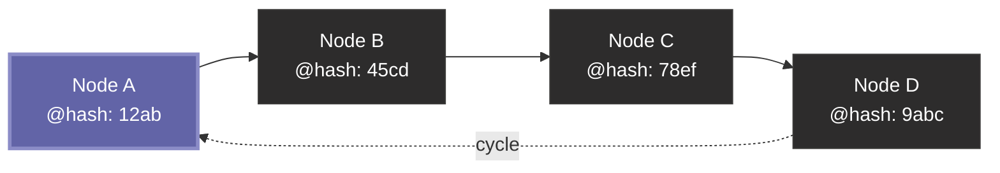
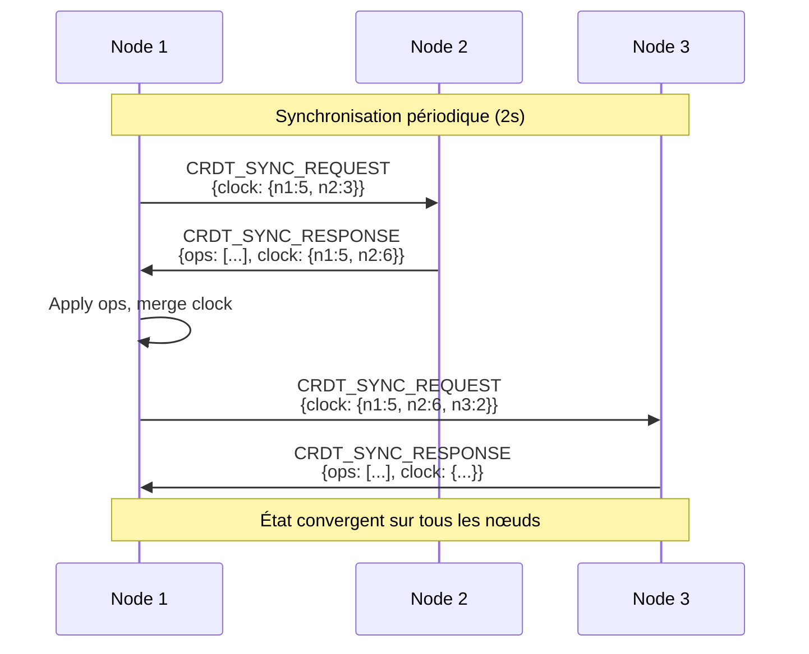
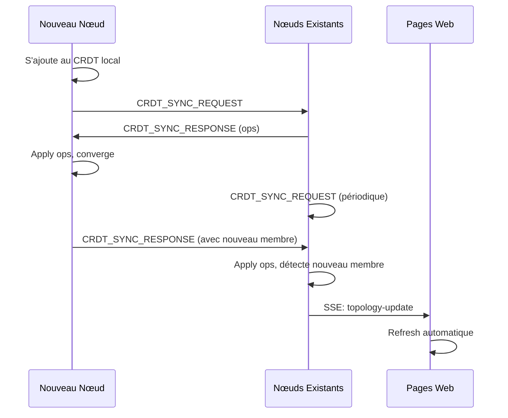
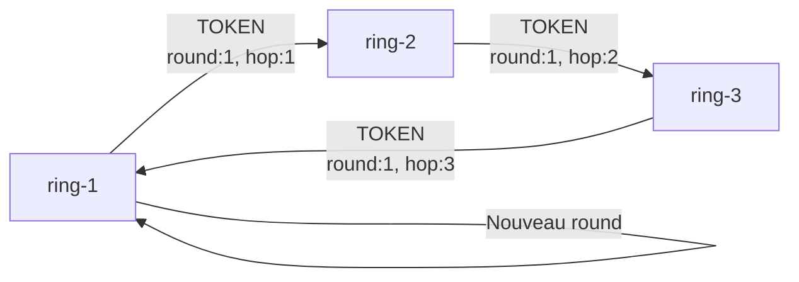

# Ring Topology Example

Cet exemple démontre une implémentation complète d'une topologie en anneau (ring) distribuée avec synchronisation d'état via CRDT, hachage cohérent, et interface web en temps réel.

## Caractéristiques

- 🔄 **Ring dynamique** : Les nœuds rejoignent et quittent dynamiquement
- 📊 **JSON CRDT** : État distribué convergent avec vector clock et HLC
- 🔐 **Hachage cohérent** : Ordre stable basé sur SHA-256 des nodeId
- 🌐 **Interface web** : Dashboard Fluent UI (Teams dark mode) avec SSE
- ⚡ **Mises à jour temps réel** : La page web est notifiée automatiquement
- 🎫 **Token passing** : Démonstration d'algorithme circulant dans le ring
- 🛡️ **Auto-guérison** : Réorganisation automatique lors de départs/pannes

## Architecture

### Front-End Load Balancer



Le front-end :

- **Spawne** les nœuds du ring en tant que processus enfants (`child_process.fork`)
- **Dashboard** : sert une page web unifiée avec statut de tous les nœuds
- **Load balancing** : les requêtes vers `/proxy/*` sont réparties en round-robin
- **Gestion dynamique** : ajouter/arrêter des nœuds via le dashboard
- **SSE** : mises à jour temps réel du statut des nœuds

Routes :

| Route | Méthode | Description |
| --- | --- | --- |
| `/` | GET | Dashboard unifié |
| `/api/nodes` | GET | Liste des nœuds (JSON) |
| `/api/nodes/add` | POST | Spawner un nouveau nœud |
| `/api/nodes/stop/:alias` | POST | Arrêter un nœud |
| `/proxy/*` | GET | Load balancer round-robin |
| `/node/:alias/*` | GET | Accès direct à un nœud |
| `/events` | GET | SSE live updates |

### Topologie du Ring



**Ordre des nœuds** : Basé sur le hash cohérent (SHA-256) du `nodeId`, pas sur l'ordre alphabétique des alias.

Chaque nœud maintient :

- **Successor** : Nœud suivant dans le ring (index + 1)
- **Predecessor** : Nœud précédent dans le ring (index - 1)
- **Ring complet** : Liste triée de tous les membres via CRDT

### Synchronisation CRDT



## Utilisation

### Démarrage basique

```bash
# Terminal 1 - avec port web aléatoire
npm start ring-1

# Terminal 2
npm start ring-2

# Terminal 3
npm start ring-3
```

### Démarrage avec ports web spécifiques

```bash
npm start ring-1 8001
npm start ring-2 8002
npm start ring-3 8003
```

Le premier argument est l'alias du nœud, le second (optionnel) est le port HTTP.

### Démarrage via le Front-End (recommandé)

Le front-end lance automatiquement les nœuds, offre un dashboard unifié et du load balancing :

```bash
# Démarrage par défaut : 3 nœuds, dashboard sur le port 3000
npm run front

# Personnaliser le port du dashboard et le nombre de nœuds
node front.js 3000 5
```

Le premier argument est le port du dashboard, le second le nombre de nœuds à spawner.

Ouvrir <http://localhost:3000> pour accéder au dashboard.

## Interface Web

### Accès

Chaque nœud démarre un serveur HTTP dont l'URL est affichée au lancement :

```bash
[ring-1] 🌐 Web interface: http://localhost:8001
```

### Fonctionnalités

L'interface web (style Fluent UI / Teams dark) affiche :

1. **En-tête avec gradient Teams** : Nom du nœud et sous-titre
2. **Carte "Node Information"** :
   - Node ID (tronqué)
   - Alias
   - Nombre de membres dans le ring
   - Successor et Predecessor
3. **Carte "CRDT State"** :
   - Vector clock complet
   - État du token (dernier round complété)
   - Intervalle de synchronisation
4. **Diagramme Mermaid temps réel** :
   - Tous les nœuds avec leur hash cohérent
   - Nœud actuel en surbrillance (violet Teams)
   - Connexions circulaires
5. **Bouton Refresh** et **Indicateur de statut SSE**

### Mises à jour automatiques (SSE)

La page se connecte à `/events` via Server-Sent Events et se rafraîchit automatiquement quand :

- Un nœud rejoint le ring
- Un nœud quitte le ring  
- Le CRDT reçoit de nouvelles opérations
- Le ring se réorganise

**Indicateur de statut** :

- 🟢 **Live updates active** : Connexion SSE établie
- 🔴 **Live updates disconnected** : Problème de connexion

## Comportement

### Démarrage d'un nœud

1. Le nœud s'enregistre auprès du PMD
2. Initialise un JSON CRDT avec `{members: {}, token: null}`
3. S'ajoute au CRDT : `members[nodeId] = {alias, nodeId, joinedAt}`
4. Démarre le serveur HTTP avec endpoint SSE
5. Lance la synchronisation CRDT périodique (toutes les 2s)
6. Notifie les clients web via SSE

### Nœud rejoignant le ring



### Nœud quittant le ring

1. PMD détecte l'absence de heartbeat (timeout)
2. Émet événement `peer:leave` aux watchers
3. Les nœuds reçoivent l'événement
4. Suppression du membre via CRDT : `del(['members', nodeId])`
5. Notification SSE aux pages web
6. Refresh automatique de l'interface

### Convergence CRDT

- **Vector Clock** : Chaque nœud suit les opérations de tous les pairs
- **HLC (Hybrid Logical Clock)** : Ordre total pour LWW
- **Last-Write-Wins** : Résolution de conflits par timestamp HLC
- **Delta Sync** : Seules les opérations manquantes sont échangées

## Messages échangés

| Type | Direction | Description |
| ------ | ----------- | ------------- |
| `CRDT_SYNC_REQUEST` | Node → Peers | Demande de sync avec vector clock local |
| `CRDT_SYNC_RESPONSE` | Peer → Node | Opérations CRDT manquantes encodées en JSON |
| `CRDT_OP` | Node → Peers | Opération CRDT individuelle (moins utilisé) |
| `TOKEN` | Node → Successor | Jeton circulant avec round et hop |
| `PING/PONG` | Node ↔ Node | Messages de test (optionnels) |

## Token Passing

Si le nœud a l'alias `ring-1`, il initie un jeton après 10 secondes :



Le jeton circule avec :

- `round` : Numéro du tour
- `hop` : Nombre de sauts dans le tour actuel
- `initiator` : Alias du nœud ayant initié le tour

Quand `hop >= ring.length`, le tour est complet et un nouveau round démarre.

## Exemple de sortie console

```bash
[ring-1] Starting ring node...
[ring-1] 🔄 Added self to ring
[ring-1] 🌐 Web interface: http://localhost:53214
[ring-1] 📡 SSE client connected (1 total)
[ring-1] ✅ Ring node started

[ring-1] Peer joined: ring-2
[ring-1] 🔄 Applied 1 CRDT ops from ring-2
[ring-1] 📊 Status: Waiting for minimum 3 nodes (current: 2)

[ring-1] Peer joined: ring-3
[ring-1] 🔄 Applied 1 CRDT ops from ring-3
[ring-1] 📊 Ring: [ring-1@a3f2b8c1] → ring-3@c7d9e4f2 → ring-2@e7d4a9f3 → (cycle)
[ring-1] 🕐 Vector Clock: {abc12345:3, def67890:2, ghi11213:1}

[ring-1] 🎫 Initiating token in the ring
[ring-1] 🎫 Passing token to ring-3
[ring-1] 🎫 Token received from ring-2 (round 1, hop 3)
[ring-1] ✅ Token completed round 1
[ring-1] 🎫 Starting new token round 2
```

## Cas d'usage

Cet exemple illustre des patterns distribués réels :

- **Consistent Hashing** : Distribution stable de données (DHT, Chord)
- **Leader Election** : Élection de leader dans un ring (Chang-Roberts)
- **Distributed Lock** : Mutex circulant via token  
- **Fault Tolerance** : Résilience aux pannes et auto-guérison
- **Eventual Consistency** : Convergence d'état via CRDT
- **Real-time Monitoring** : Dashboard distribué avec SSE

## Détails techniques

### Hachage cohérent

```javascript
function consistentHash(nodeId) {
  const hash = crypto.createHash('sha256').update(nodeId).digest();
  return hash.readUInt32BE(0) * 0x100000000 + hash.readUInt32BE(4);
}
```

Les nœuds sont triés par valeur de hash croissante, assurant :

- Distribution uniforme sur l'anneau
- Stabilité : l'ajout/retrait affecte seulement les voisins
- Déterminisme : même ordre sur tous les nœuds

### Vector Clock

Chaque nœud maintient `{nodeId: counter}` pour tous les pairs :

- Incrémenté à chaque opération locale
- Mergé lors de réception d'opérations distantes
- Utilisé pour détecter les opérations manquantes

### HLC (Hybrid Logical Clock)

Structure : `{t: wallTime, c: counter, r: replicaId}`

- Combine temps physique et logique
- Fournit un ordre total pour LWW
- Tie-break sur `replicaId` si `t` et `c` identiques

## Notes

- ⚠️ **Minimum 3 nœuds** requis pour former un ring valide
- 🏷️ Les alias doivent commencer par `ring-` pour reconnaissance
- 🔄 Synchronisation CRDT toutes les 2 secondes
- 📱 Interface web compatible mobile (viewport responsive)
- 🎨 Thème Fluent UI avec palette Teams officielle
- 💾 Pas de persistance : état en mémoire uniquement
